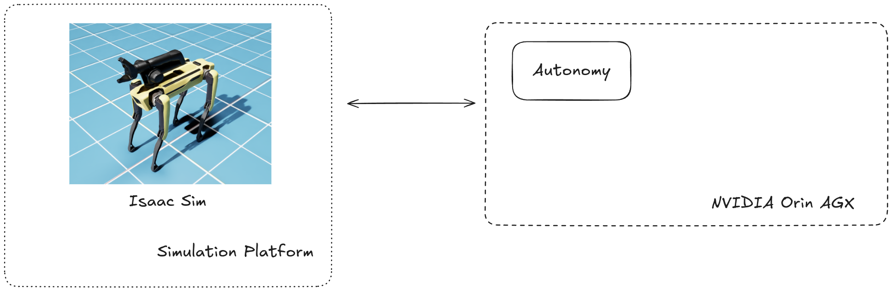
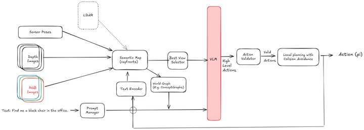

# Spot Autonomy with Sim2Real setup
## Overview
This project is designed to create a robot with Sim2Real capabilities. The development follows conventions based on [Airstack/Robot](https://github.com/castacks/AirStack/tree/develop/robot).



### Project Structure
1. `docker/` - Contains the Dockerfile for building the robot image.
2. `simulation/` - Includes simulation files for the robot that interface with Isaac Sim.
3. `ros_ws/` - ROS2 workspace for the robot's autonomy and control.

### Autonomy



## Table of Contents
- [setup](#setup-instructions)


---

## Setup Instructions

### Clone the Repository with Submodules
To clone the repository along with its submodules, use:
```bash
git clone --recurse-submodules git@github.com:strapsai/navi.git
```
If the repository was cloned without submodules, initialize and update them with:
```bash
git submodule update --init --recursive
```

### Build the Docker Image
1. Navigate to the `docker` directory:
   ```bash
   xhost +
   docker compose -f docker/docker-compose-x86.yaml up -d
   ```
2. Open isaac sim and open 
   
